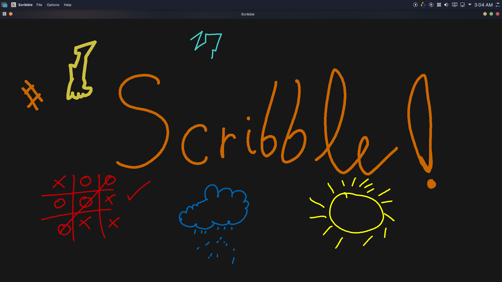

# Scribble



A really simple paint application made using Qt.

## Building From Source

### Prerequisites
* Qt
* C++17 Compiler

```
git clone https://github.com/oddStoneGames/Scribble.git
cd Scribble
./Scribble.pro
```

The above code should open the Scribble Qt project, from there you should be able to build & run it.